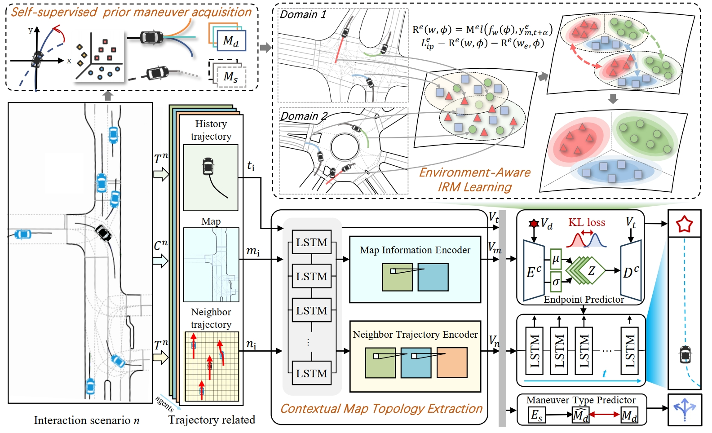

# IRMTraj: Maneuver-Aware Invariant Risk Minimization for Generalized Trajectory Prediction in Unseen Domain

This is the source code of our IRMTraj.

## Overview



Predicting the future trajectories of surrounding agents is crucial for proactive and intelligent decision-making of autonomous vehicles. Among all techniques, domain generalization is a significant concern, as maintaining robust prediction performance is often difficult in the face of data shifts caused by open-world environments, such as varying road structures and evolving traffic regulations. This paper introduces a trajectory prediction method named **IRMTraj**, focused on enhancing generalization of trajectory prediction model in unseen testing domains. We specifically identify maneuver as a potential cause for the decline in domain generalization. We specifically highlight maneuver-type variability as a key factor contributing to the challenge of domain generalization, as different maneuvers introduce significant shifts in trajectory patterns across domains. We first propose a self-supervised maneuver-type prediction module, which perceives maneuver-type as clues for environment partition. Besides, our approach integrates prior maneuver-type into IRM for learning environment-invariant causal features, enabling progressive prediction of future trajectories based on decomposed driving intentions. Furthermore, we develop a Contextual Map Topology Extraction module to model the influence of the surrounding topological road structures on the trajectory. Experiments demonstrate that our model significantly outperforms state-of-the-art competitors, with up to 2.3 times reduction in mFDE across both cross-map and cross-scenario domain generalization tasks.


## Highlights

1. We propose a **maneuver-aware generalized trajectory prediction** model that integrates map topological information and endpoint prediction. By finely partitioning domains into environments based on maneuver-type, we conduct transfer learning of generalized features within these environments and enhance feature learning through Self-supervised Maneuver-type Prediction tasks.

2. We introduce an **environment-aware IRM endpoint prediction** module. By using maneuver-type as a fine-grained environment and integrating it into the IRM framework, we enhance the generalization of endpoint prediction, which in turn improves the generalization of the subsequent complete trajectory prediction.

3. We propose a **spatial topological feature** extraction network for contextual map information modeling. This network enhances this by constructing a topological information extraction grid and identifying topologically related neighboring nodes for each road.

4. We designed cross-scenario and cross-map experiments targeting unseen domains in trajectory datasets, demonstrating that our method achieves **state-of-the-art** performance with a significant improvement up to 2.3 times.


## Implement

<!--

### 1. Requirements
Recommend version:
```
PyTorch = 2.0.0;
python = 3.10;
CUDA = 12.1;
```

Other packages:
```
pip install -r requirements.txt
```

Install "pointnet2_ops_lib":
```
cd ./pointet2_ops_lib
python setup.py install
```

Install extension for Chamfer Distance:
```
cd ./extensions/chamfer_dist
python setup.py install
```

### 2. Pretraining
To train DG-PIC on the new **multi-domain and multi-task setting**, run the following command:

```
python main.py --config cfgs/DGPIC_<target_domain>.yaml --exp_name exp/DGPIC_<target_domain>
```

Replace the `<target_domain>` by `[modelnet, shapenet, scannet, scanobjectnn]`. The remaining 3 datasets will be considered as the source domains.

### 3. Testing

To obtain the performance of the target domain on 3 different tasks through our **Test-time Domain Generalization** method, run the following command:

```
python test_dg.py --config cfgs/DGPIC_<target_domain>.yaml --exp_name DGPIC_<target_domain> --ckpts experiments/DGPIC_<target_domain>/ckpt-last.pth
```

-->
